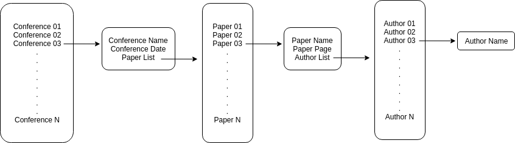

# Conference Information Management Program

## Overview

In this project, I make Conference Information Management Program with __Red-Black tree__. This Data Structure is implemented using __C++__. This Data Structure, Red-Black Tree, was choosen because there are more searches than addition.

## Data Structure

__Red Black Tree__

A red–black tree is a kind of self-balancing binary search tree in computer science. Each node of the binary tree has an extra bit, and that bit is often interpreted as the color (red or black) of the node. These color bits are used to ensure the tree remains approximately balanced during insertions and deletions.

Balance is preserved by painting each node of the tree with one of two colors in a way that satisfies certain properties, which collectively constrain how unbalanced the tree can become in the worst case. When the tree is modified, the new tree is subsequently rearranged and repainted to restore the coloring properties. The properties are designed in such a way that this rearranging and recoloring can be performed efficiently.
The balancing of the tree is not perfect, but it is good enough to allow it to guarantee searching in O(log n) time, where n is the total number of elements in the tree. The insertion and deletion operations, along with the tree rearrangement and recoloring, are also performed in O(log n) time.
Tracking the color of each node requires only 1 bit of information per node because there are only two colors. The tree does not contain any other data specific to its being a red–black tree so its memory footprint is almost identical to a classic (uncolored) binary search tree. In many cases, the additional bit of information can be stored at no additional memory cost.
Because of this operation, Red-Black Tree takes longer to store than other data structure. But shows excellent speed in data retrieval.
[Wikipedia_'Red Black Tree'](https://en.wikipedia.org/wiki/Red%E2%80%93black_tree)

__Data Structure of this project__


## Usage

### Delvopment Environments

Ubuntu 18.04.3 LTS

### Execute

$ ./bin/main

### MENU

```Markdown
   Conference Information Management Program
 -- ID - Command -----------------------------
     1 : User Mode
     2 : Manage Mode
     3 : Import Data From a Text File
     0 : Quit
 ---------------------------------------------
```

Main Menu. User can choose Mode.

```Markdown
   User Mode
 -- ID - Command -----------------------------
     1 : Display Conference name list
     2 : Retrieve by keyword
     0 : Quit
 ---------------------------------------------
```

User Mode Menu, User can Display all Conference information or Retrieve Conference by keyword.

```Markdown  
   Manage Mode
 -- ID - Command -----------------------------
     1 : Display Conference list
     2 : Add Conference
     3 : Delete Conference
     4 : Replace Conference
     5 : Paper Management Mode
     0 : Quit
 ---------------------------------------------
```

Manage Mode Menu, User can add, delete, modify Conference information.
