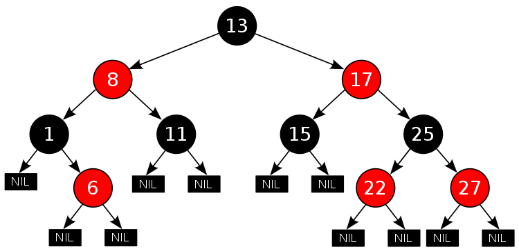

# Conference Information Management Program

[](https://travis-ci.org/Gaejuk2/DataStructure_RedBlackTree)

## Overview

__Conference Information Management Program__ 은 데이터의 추가, 삭제보다는 데이터의 검색 횟수가 더 많을 것으로 예측하여, 데이터의 검색이 매우 빠른 __Red Black Tree__ 를 자료구조로 선택하였다. 이 Red Black Tree의 원리를 이해하고 이를 __C++__ 로 직접 구현하여 사용하였다.

## Data Structure

### Red Black Tree



A red–black tree is a kind of self-balancing binary search tree in computer science. Each node of the binary tree has an extra bit, and that bit is often interpreted as the color (red or black) of the node. These color bits are used to ensure the tree remains approximately balanced during insertions and deletions.


Balance is preserved by painting each node of the tree with one of two colors in a way that satisfies certain properties, which collectively constrain how unbalanced the tree can become in the worst case. When the tree is modified, the new tree is subsequently rearranged and repainted to restore the coloring properties. The properties are designed in such a way that this rearranging and recoloring can be performed efficiently.
The balancing of the tree is not perfect, but it is good enough to allow it to guarantee searching in O(log n) time, where n is the total number of elements in the tree. The insertion and deletion operations, along with the tree rearrangement and recoloring, are also performed in O(log n) time.
Tracking the color of each node requires only 1 bit of information per node because there are only two colors. The tree does not contain any other data specific to its being a red–black tree so its memory footprint is almost identical to a classic (uncolored) binary search tree. In many cases, the additional bit of information can be stored at no additional memory cost.
Because of this operation, Red-Black Tree takes longer to store than other data structure. But shows excellent speed in data retrieval.

[Wikipedia_'Red Black Tree'](https://en.wikipedia.org/wiki/Red%E2%80%93black_tree)

Red Black Tree는 Self Balancing Binary Tree이다. 각 노드에는 검은색이나 빨간색으로 색깔이 있으며 Root에서 각 Leaf까지의 Red Node의 갯수가 고르게 분포하도록 Balance를 스스로 조정하는 함수가 데이터를 추가할 때마다 실행된다. 따라서, 데이터의 추가에는 시간이 소요되는 편이지만, **항상 Balance가 최적임을 보장**하므로 검색하는 시간이 다른 자료구조에 비해 비교적 빠르다.

### Data Structure of this project

Conference의 Information은 다음과 같이 구성되어 있다. 각 Node들은 Red Black Tree에 속해 있으면서 Red Black Tree를 소유하고 있는 형태로써, **3중 Red Black Tree** 구조이다.


## Usage

### Execute

$ ./bin/main

### MENU

```Markdown
   Conference Information Management Program
 -- ID - Command -----------------------------
     1 : User Mode
     2 : Manage Mode
     3 : Import Data From a Text File
     0 : Quit
 ---------------------------------------------
  -> Choose a Command :
```

Main Menu. User can choose Mode.

```Markdown
   User Mode
 -- ID - Command -----------------------------
     1 : Display Conference name list
     2 : Retrieve by keyword
     0 : Quit
 ---------------------------------------------
  -> Choose a Command :
```

User Mode Menu, User can Display all Conference information or Retrieve Conference by keyword.

```Markdown  
   Manage Mode
 -- ID - Command -----------------------------
     1 : Display Conference list
     2 : Add Conference
     3 : Delete Conference
     4 : Replace Conference
     5 : Paper Management Mode
     0 : Quit
 ---------------------------------------------
  -> Choose a Command :
```

Manage Mode Menu, User can add, delete, modify Conference information.

ex) Display Conference List In User Menu

```markdown

  -- Current list ----------------------------

    Conference Name  : 3DV_Vision
    Conference Date  : 2016.10.25
    Paper List:
      A_Hybrid_Structure/Trajectory_Constraint_for_Visual_SLAM
      A_Large-Scale_3D_Object_Recognition_Dataset
      Energy-Based_Global_Ternary_Image_for_Action_Recognition_Using_Sole_Depth_Sequences
      Fast_Obstacle_Detection_Using_Sparse_Edge-Based_Disparity_Maps
      HS-Nets:_Estimating_Human_Body_Shape_from_Silhouettes_with_Convolutional_Neural_Networks
      Matching_Deformable_Objects_in_Clutter
      Monocular,_Real-Time_Surface_Reconstruction_Using_Dynamic_Level_of_Detail
      Progressive_3D_Modeling_All_the_Way
      Real-Time_Surface_of_Revolution_Reconstruction_on_Dense_SLAM
      Registration_of_Point_Clouds_Based_on_the_Ratio_of_Bidirectional_Distances
      Robust_Feature-Preserving_Denoising_of_3D_Point_Clouds
      Robust_Recovery_of_Heavily_Degraded_Depth_Measurements
      SceneNN:_A_Scene_Meshes_Dataset_with_aNNotations

    Conference Name  : ACII
    Conference Date  : 2017.10.23
    Paper List:
      Automated_mood-aware_engagement_prediction
      Comparing_empathy_perceived_by_interlocutors_in_multiparty_conversation_and_external_observers
      Computational_model_of_idiosyncratic_perception_of_others'_emotions
      Effects_of_valence_and_arousal_on_working_memory_performance_in_virtual_reality_gaming
      How_different_identities_affect_cooperation
      NAA:_A_multimodal_database_of_negative_affect_and_aggression
      Recognizing_induced_emotions_of_movie_audiences:_Are_induced_and_perceived_emotions_the_same
      What_really_matters_-_An_information_gain_analysis

    Conference Name  : DAI
    Conference Date  : 1998.05.01
    Paper List:
      Conception,_Behavioral_Semantics_and_Formal_Specification_of_Multi-Agent_Systems
      Learning_Message-Related_Coordination_Control_in_Multiagent_Systems
      Team_Formation_by_Self-Interested_Mobile_Agents

    Conference Name  : MACIS
    Conference Date  : 2017.11.15
    Paper List:
      Certification_Using_Newton-Invariant_Subspaces
      Decomposition_of_Low_Rank_Multi-symmetric_Tensor
      Efficient_Certification_of_Numeric_Solutions_to_Eigenproblems

    Conference Name  : PACIS
    Conference Date  : 2017.07.16
    Paper List:
      A_Bibliographic_Network_Analysis_of_Big_Data_Literature
      Investigating_the_Use_of_MOOCs:_An_Innovation_Adoption_Perspective
      Research_Perspective_in_Enterprise_Architecture
      Understanding_the_Continuous_Use_of_Fitness_Trackers:_A_Thematic_Analysis

    Conference Name  : TAP
    Conference Date  : 2016.06.05
    Paper List:
      Advances_in_Property-Based_Testing_for_\alpha_Prolog
      Classifying_Bugs_with_Interpolants
      Classifying_Test_Suite_Effectiveness_via_Model_Inference_and_ROBBDs
      Monadic_Sequence_Testing_and_Explicit_Test-Refinements
      Tests_and_Proofs_for_Enumerative_Combinatorics
      Your_Proof_Fails?_Testing_Helps_to_Find_the_Reason

    Conference Name  : VISAPP
    Conference Date  : 2018.01.27
    Paper List:
      A_Real-Time_Edge-Preserving_Denoising_Filter
      Efficient_Projective_Transformation_and_Lanczos_Interpolation
      Infrared_Image_Enhancement_in_Maritime_Environment_with_Convolutional_Neural_Networks
      Joint_Brightness_and_Tone_Stabilization_of_Capsule_Endoscopy_Videos
      Towards_an_Augmented_Reality_Head_Mounted_Display_System

  --------------------------------------------

```
